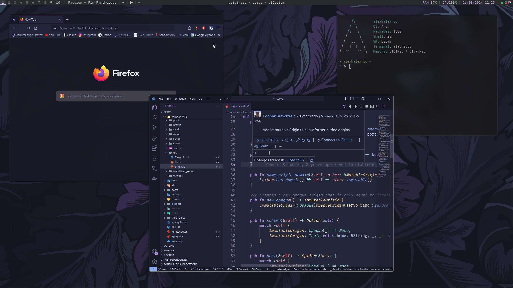

# dotfiles

My personal dotfiles (config files and scripts) for my Arch machine.

## Screenshots

## Programs

- Window manager: [bspwm](https://github.com/baskerville/bspwm)
- Compositor: [picom](https://github.com/yshui/picom)
- Terminal: [Alacritty](https://github.com/alacritty/alacritty)
- Notification daemon: [dunst](https://github.com/dunst-project/dunst)
- Status bar: [polybar](https://github.com/polybar/polybar)
- Hotkey daemon: [sxhkd](https://github.com/baskerville/sxhkd)
- Shell: [zsh](https://www.zsh.org/)

## Fonts

- SF Mono Nerd Font Ligaturized: [Repo](https://github.com/shaunsingh/SFMono-Nerd-Font-Ligaturized)
- Jetbrains Mono: [Repo](https://github.com/JetBrains/JetBrainsMono)
- Fira Code: [Repo](https://github.com/tonsky/FiraCode)
- Hack: [Repo](https://github.com/source-foundry/Hack)
- SF Pro Text: [Repo](https://github.com/sahibjotsaggu/San-Francisco-Pro-Fonts)
- SF Pro Display: [Repo](https://github.com/sahibjotsaggu/San-Francisco-Pro-Fonts)
